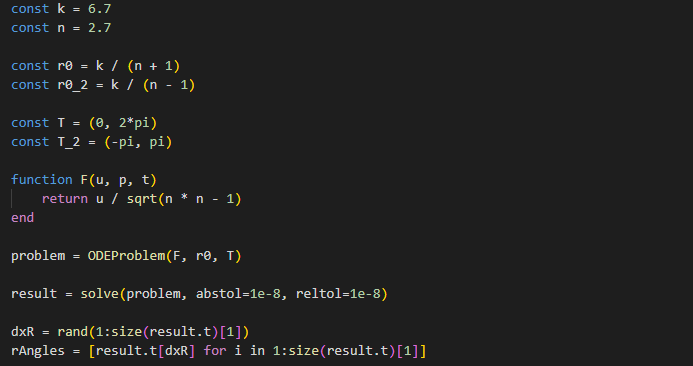

---
## Front matter
lang: ru-RU
title: Лабораторная работа №2
subtitle: Задача о погоне
author:
  - Гарут А. И.
institute:
  - Российский университет дружбы народов, Москва, Россия
date: 17 февраля 2024

## i18n babel
babel-lang: russian
babel-otherlangs: english

## Formatting pdf
toc: false
toc-title: Содержание
slide_level: 2
aspectratio: 169
section-titles: true
theme: metropolis
header-includes:
 - \metroset{progressbar=frametitle,sectionpage=progressbar,numbering=fraction}
 - '\makeatletter'
 - '\beamer@ignorenonframefalse'
 - '\makeatother'
---

## Докладчик

:::::::::::::: {.columns align=center}
::: {.column width="70%"}

  * Гарут Александр Игоревич
  * студент группы НФИбд-01-21
  * Российский университет дружбы народов

:::
::: {.column width="30%"}

:::
::::::::::::::

## Цели и задачи

1. Провести аналогичные рассуждения и вывод дифференциальных уравнений,
если скорость катера больше скорости лодки в n раз (значение n задайте
самостоятельно)
2. Построить траекторию движения катера и лодки для двух случаев. (Задайте
самостоятельно начальные значения)
Определить по графику точку пересечения катера и лодки

## Результаты

{#fig:001 width=70%}

## Результаты

{#fig:001 width=70%}

## Вывод

Решили задачу о погоне.
